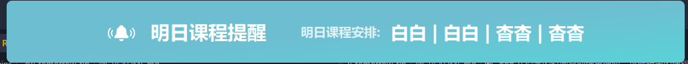

# 明日课程提醒

> 🕘 **在设定时间自动提醒你明天的课程安排，不再忘记每一节课喵！**

---

### ✨ 功能
- ⏰ **定时提醒**  
  在你设定的时间自动弹出通知，以「课程1 | 课程2 | 课程3...」的形式展示明日课程安排。

- 🎯 **课程筛选**  
  可自定义最多显示的课程数量，也可排除不需要提醒的特定课程（比如自习课？嘿嘿(｡•̀ᴗ-)✧）。

- 🛠️ **通知时长**  
  支持设置通知的显示时长，让你不会错过任何消息～

### 🐟 如何使用
  - 自己探索吧,我就是不写文档,有本事来艹我啊
